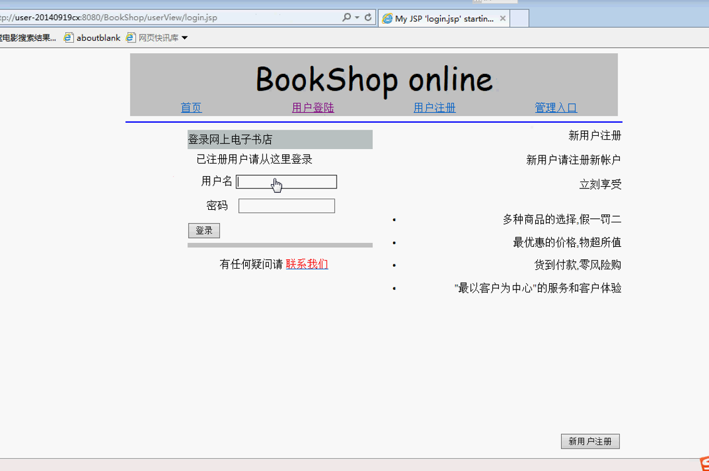

# java bookshop 网上书城
# 环境
	myeclipse 10
	mysql

#使用
	首先配置数据：mysql.sql
	之后导入项目，修改数据库配置文件：BookShop\BookShop\src\manager\DBManaget.java 里面的数据库连接的地址和密码
	private String url = "jdbc:mysql://localhost:3306/bookshop?autoReconnect=true&UseUnicode=true&"  
			+ "characterEncoding=UTF-8";

	private String username = "root";

	private String password = "7684751";
# 联系：wantongtang@foxmail.com
演示：

